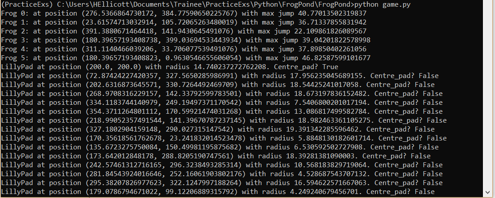
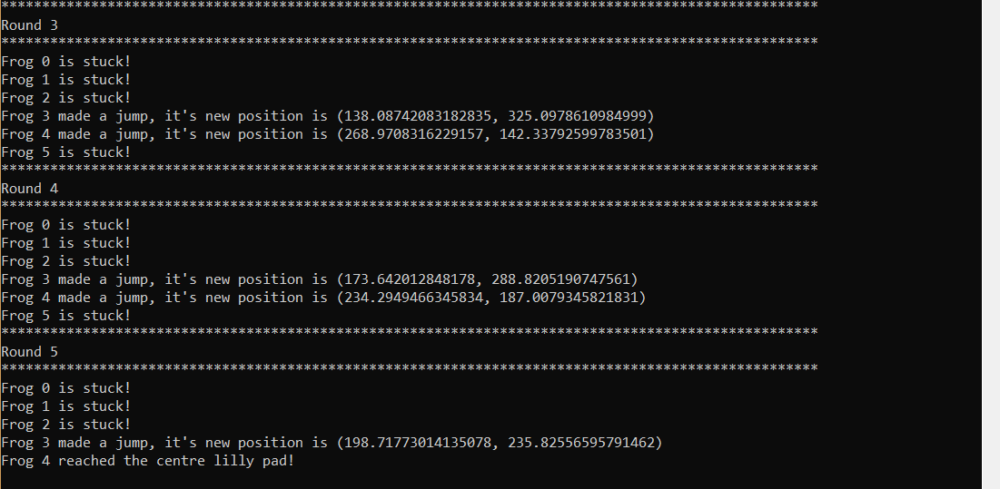
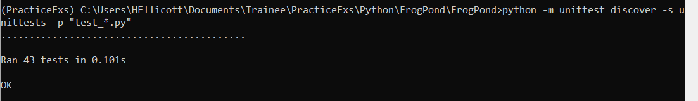
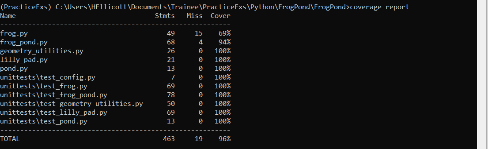

# FrogPond
## The task
You are a member of the Amphibian team delivering the Frogs in A Pond system. 
Your team consists of:
- Project Manager
- Requirements Analyst
- Solution Architect
- Tech Lead
- Engineer
- Test Lead
- Test Engineer
- Product Owner

The Product Owner, Project Manager, Tech Lead and Test Lead will be 'played' by 
those running the task.

**Trainee Engineers** you will act as Requirements Analyst, Solution Architect and 
Engineer. You should work together with the other trainees to gather a set of 
requirements from your Product Owner. Then individually design and write your solution.

**Trainee Testers** you will act as Requirements Analyst and Test Engineer. You 
should work together with the other trainees to gather a set of requirements from 
your Product Owner. Then work with a trainee engineer to build a test strategy and 
ensure there are clear acceptance criteria.


---

Engineers and Testers will work together to deliver this critical Frogs in a Pond 
system to stakeholders. Throughout your development you should ensure you keep your 
Project Manager and Product Owner engaged. There will be drop in sessions every other
to week which allow you to share your progress and ask questions. In between you will be able to ask 
questions on the teams channels.
---

You are expected to manage this project using engineering best practices as if it 
was an actual project. We expect:
- Clear system design
- Board with stories and tasks with acceptance criteria (maybe even epics and features)
- TDD
- Use of version control (maybe even with CI/CD pipeline)

## The brief
There is a pond

The pond has a number of frogs on its perimeter

The pond has a number of lilly pads on the surface

The pond has one lilly pad at its centre

Each frog can jump a maximum distance within a set range

Each lilly pad has a diameter within a set range

Each frog tries to jump to a lilly pad which is:
- the central lilly pad if in range
- otherwise another lilly pad which is:
  - within range
  - not been visited by this frog before
  - doesn't have another frog on it
  
If there are no possible lilly pads to jump to the frog is out

This continues until either the frog lands on the centre lilly pad or all frogs are out

## The requirements (gathered from the product owner) 
Pond 
- Circle (Polygon) 
- Radius (r_pond) 
  - Given as parameter 

Lily Pad 
- Circle (Polygon) 
- Radius 
  - Each pad can have a different size 
  - Size range, 2-(parameter)% of r_pond 
  - i.e. Parameter given is the max size of a pad as a percentage of r_pond 
- Number 
  - Given as parameter 
  - At least 1 
  - One must be at the centre of the pond 
  - They should not overlap each other

Frog 
- Point 
- Number 
  - Given as parameter 
  - At least 2 
- Jumping 
  - Differ in max jumping distance 
    - But can jump less than the max 
  - Range of max distances given as parameters (i.e. min and max max_range) 
  - Jump one at a time 
  - Once landed can move freely on the pad
    - So can land on one edge and start the next jump from the opposite edge
  - Can jump in a random order, but the same order every turn 
    - (e.g. 1, 4, 2, 3 – 1, 4, 2, 3 – 1, 4, 2, 3…) 
---
**Stretch goal** 
- Visualize the output of running the frog pond 

# This repo
This repo contains a sample solution for task. Your solution may look nothing like this, 
but viewing this may help to picture the end goal.
## Running the program
#### Simulation
To run the simulation and view the visualised starting point and the verbose output 
use this command from the FrogPond directory:
```
>python game.py
```
This will open a pop up window showing a visualisation of the starting points of the frogs and 
location of the lilly pads. 


To continue running the simulation, close this window and the verbose 
output will be printed in the terminal.






#### Tests
To run the unittests on command line run the following command from the FrogPond directory:
```
>python -m unittest discover -s unittests -p "test_*.py"
```



#### Code coverage
Ensure you have coverage.py installed

To calculate the code coverage of the tests run the following command from the FrogPond directory:
```
>coverage run -m unittest discover -s unittests -p "test_*.py"
```
Then to view the results use `>coverage report` or `>coverage html`


